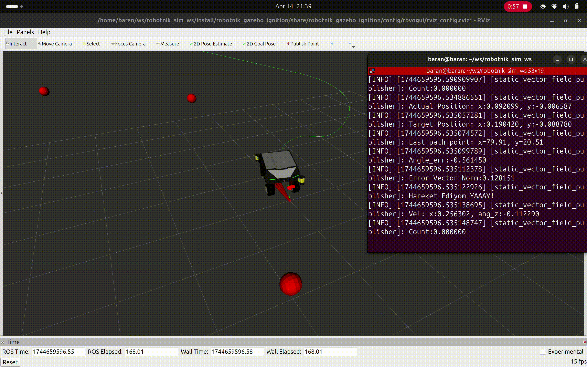

# Robotics Portfolio

Welcome to my robotics project portfolio.  
This repository showcases selected projects related to robotics simulation, control systems, and ROS 2 software development.

I am currently studying **Robotic Systems at RWTH Aachen University**, focusing on robotics dynamics, autonomous systems, and ROS-based robotic software.

My goal is to develop strong practical experience in robotics by building simulation models, implementing control algorithms, and developing modular robotics software.

---

# Projects

## Control Moment Gyroscope for Bicycle Stabilization

Project Link:  
[CMG for Bicycle](https://github.com/Kokjix/CMG-for-Bicycle)

The objective is to analyze whether gyroscopic actuation can stabilize a two-wheeled vehicle by generating corrective torques that counteract roll motion.

The system is modeled using the dynamic equations of the bicycle and the gyroscopic actuator. Simulations are used to observe the behavior of the system under disturbances.

### Key Topics

- Bicycle roll dynamics modeling
- Control Moment Gyroscope (CMG) actuation
- Dynamic system simulation
- Stability analysis

### Technologies

- MATLAB
- Simulink
- Control systems
- Dynamic modeling

---

## ROS 2 Robotics Exercises

Project Link:  
[ROS 2 Exercises](https://github.com/Kokjix/ROS-2-Exercises)

Demo:

This repository contains a collection of projects developed to strengthen practical **ROS 2 robotics software development skills**.

The exercises focus on implementing core robotics concepts such as robot control, odometry estimation, and navigation strategies using ROS 2 nodes.

The goal of this repository is to build a strong foundation in developing modular robotics software for autonomous systems.

### Key Topics

- ROS 2 node development
- Topic-based communication
- Robot velocity control
- Odometry estimation
- Vector field based navigation

### Technologies

- ROS 2
- C++
- Gazebo
- RViz
- Eigen

---
## Robotics Simulations

Project Link:  
[Robotics Simulations](https://github.com/Kokjix/Simulations)

Demo:

This repository contains Gazebo-based simulations for **Rover 21 and Rover 22 systems**, including mobile bases and robotic arms. It is designed to test **navigation, perception, and manipulation algorithms** in realistic simulated environments.

The simulations cover:

- Rover 21: small rovers with different sensors  
  - ZED stereo camera  
  - Intel D435 camera  
  - Velodyne LiDAR  
- Rover 21 with robotic arm: includes two FPV cameras and a D435 camera mounted on the arm  
- Rover 22: upgraded system versions with similar capabilities

### Features

- IMU and GPS sensor integration  
- Navigation and localization with ROS packages  
- Robotic arm manipulation in simulation  
- Sensor data acquisition and testing

### Technologies

- ROS (Melodic)  
- Gazebo  
- RViz  
- ROS packages for localization and perception  
- C++ / Python

---

# Publication

I contributed to a research paper presented at the **INTER-NOISE Conference** as part of a research project.

The work involved engineering analysis and simulation within a collaborative research environment.
Link: [Read the full paper](https://ince.publisher.ingentaconnect.com/content/ince/incecp/2024/00000270/00000004/art00054;jsessionid=1x2l872ddtzzs.x-ic-live-02)

---

# About Me

I am a robotics engineer with a strong interest in:

- Robotics dynamics
- Control systems
- Autonomous robotics
- Simulation and modeling
- ROS-based robotic software

Previously, I worked as a **robotics developer at Ilitron**, where I contributed to R&D projects involving robot dynamics, dynamic parameter identification, and ROS-based robotic systems.

Currently, I am building robotics projects to strengthen my expertise in **ROS 2, simulation, and autonomous robotics systems**.

---

# Contact

GitHub  
https://github.com/Kokjix

Email:  
- baranberkbagci@gmail.com

**or**
- baran.berk.bagci@rwth-aachen.de
